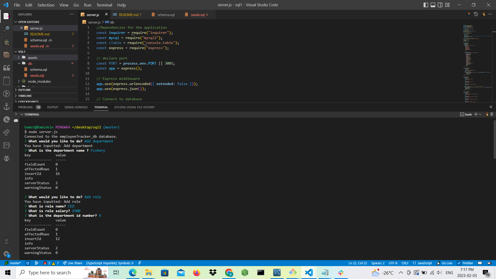
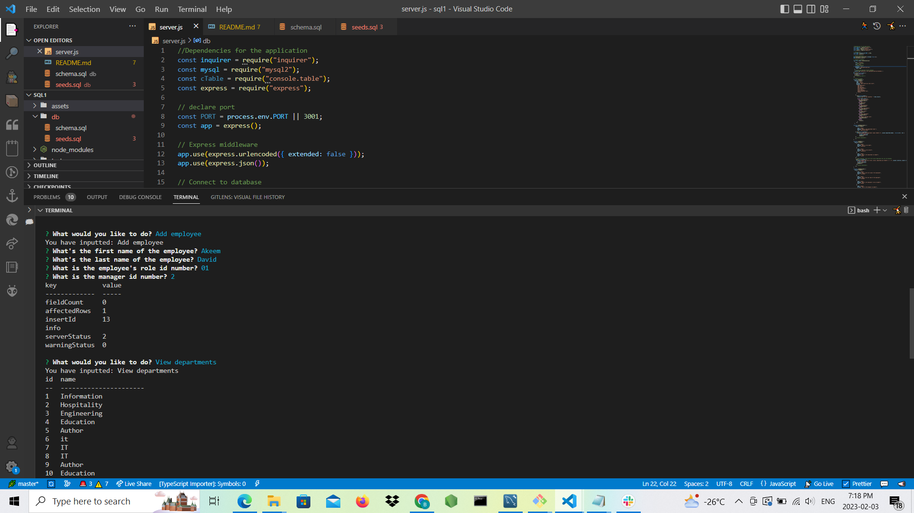
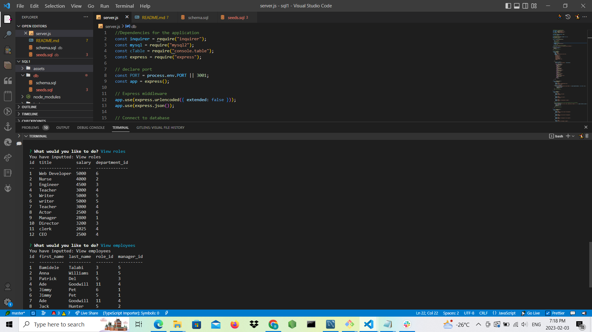

# Employee Tracker
The application is called Employee Tracker which built for a company to manage employee database using a command-line interface. The project is designed using Node.js to run on a terminal, Inquirer for user prompts, console table for tables display  and MySQL for generating database. 

When a user follows the prompts to create database, the user can get departments, department IDs, job titles, role IDs, salary for the role, employee firstName and secondName, employee roles, employee IDs, salaries and manager's employees. Having inputted the data in the terminal, table will be created to show the formation of the employees. In addtion, employee data can be updated.

## Application Interface Image

## Video Demonstration the Application Functionality
https://drive.google.com/file/d/1n-xg32Nut6VitnbijqzzBgfVyymNvJA7/view

##  URL of the GitHub repository